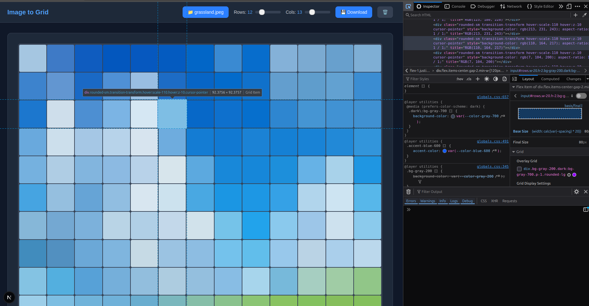

# Image to HTML Grid Pixel Converter

A modern web app that transforms your images into HTML grid pixels. Upload any image, adjust the grid dimensions, and watch as it gets converted into an interactive pixel grid where each cell represents the average color of that section of your image.

## What Does It Do?

Ever wanted to see what your image looks like as a pixelated grid? This app takes any image you upload and breaks it down into a customizable grid of colored squares. Each square displays the average color of that portion of your original image, creating a pixel art effect.

It's perfect for:
- Creating pixel art from photos
- Visualizing images in a unique way
- Understanding how images can be represented as color grids
- Generating downloadable pixel grid images

## Features

- **Upload Any Image** - Supports all common image formats
- **Adjustable Grid Size** - Control rows and columns (2-50) with smooth sliders
- **Real-time Preview** - See your pixel grid update instantly
- **Download Your Creation** - Export your pixel grid as a PNG image
- **Dark Mode Support** - Works beautifully in both light and dark themes
- **Responsive Design** - Clean, minimal interface that works on any device

## Getting Started

First, install the dependencies:

```bash
npm install
```

Then, run the development server:

```bash
npm run dev
```

Open [http://localhost:3000](http://localhost:3000) in your browser to start converting images to pixel grids!

## How It Works

1. **Upload an Image** - Click the upload button in the navbar
2. **Adjust Grid Dimensions** - Use the sliders to set how many rows and columns you want
3. **Watch the Magic** - Your image is automatically converted to a grid of colored pixels
4. **Download** - Save your pixel grid creation as a PNG

The app analyzes your image by dividing it into cells based on your grid settings, then calculates the average RGB color for each cell to create the pixel effect.

## Tech Stack

Built with:
- [Next.js 16](https://nextjs.org) - React framework
- [TypeScript](https://www.typescriptlang.org) - Type safety
- [Tailwind CSS](https://tailwindcss.com) - Styling
- Canvas API - Image processing

## Screenshots

#### Each cell is HTML div element


